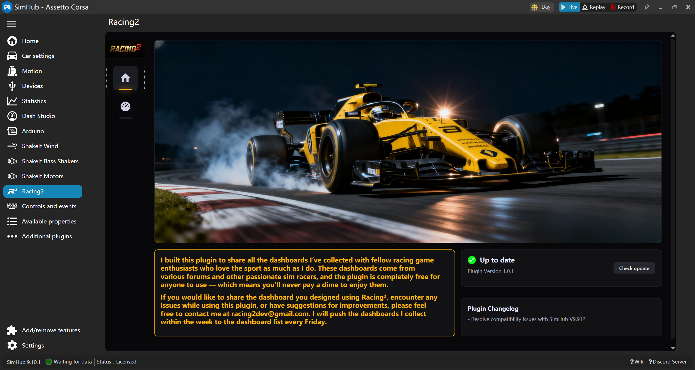
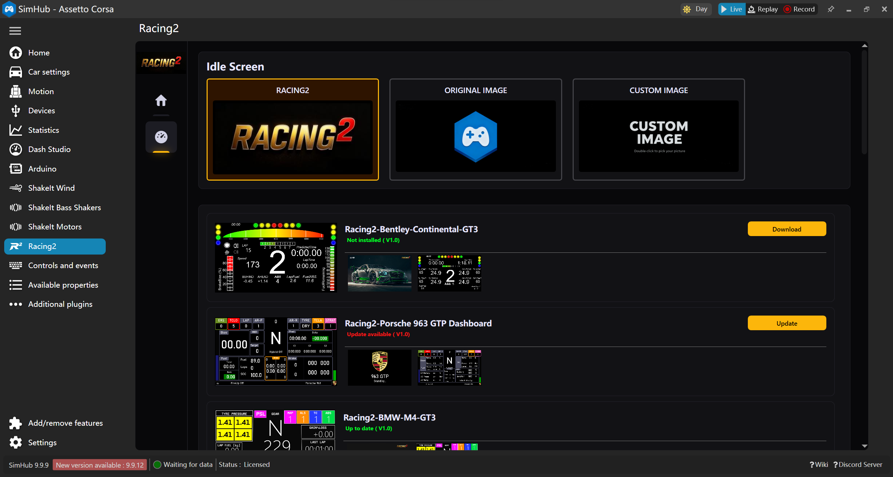

# Racing2 Plugin for SimHub

A SimHub plugin that provides dashboard interface downloads.

## Screenshots / 界面截图

### Main Interface / 主界面

### Dashboards List / 仪表盘列表

## Installation / 安装方法

1. Copy `Racing2.Plugin.dll` from the `Main` folder to your SimHub installation directory.
2. Run SimHub with administrator privileges.
3. Enable the Racing2 Plugin in the popup dialog or through "Add/remove features" section.

安装步骤：
1. 将 `Main` 文件夹中的 `Racing2.Plugin.dll` 复制到 SimHub 的安装目录中
2. 以管理员身份运行 SimHub
3. 在弹窗或 "Add/remove features" 中启用 Racing2 Plugin

## Requirements / 系统要求

- SimHub installed
- Administrator privileges for SimHub execution

系统要求：
- 已安装 SimHub
- 需要管理员权限运行 SimHub